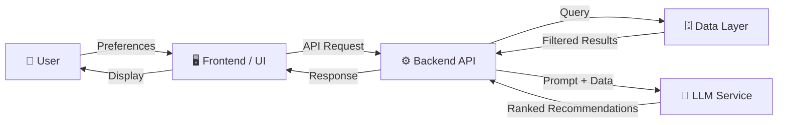
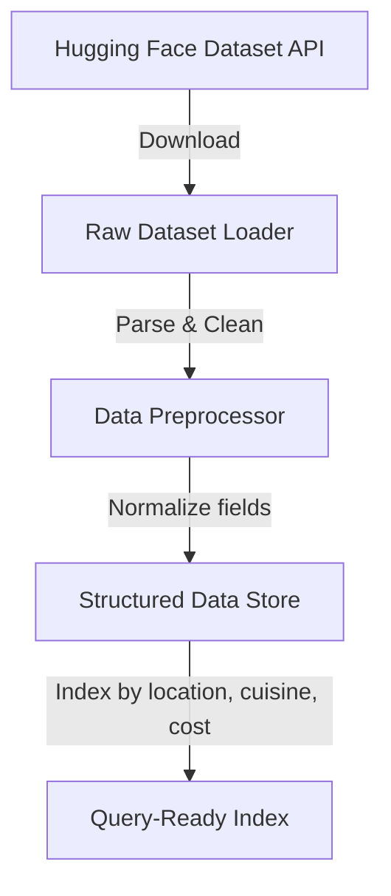
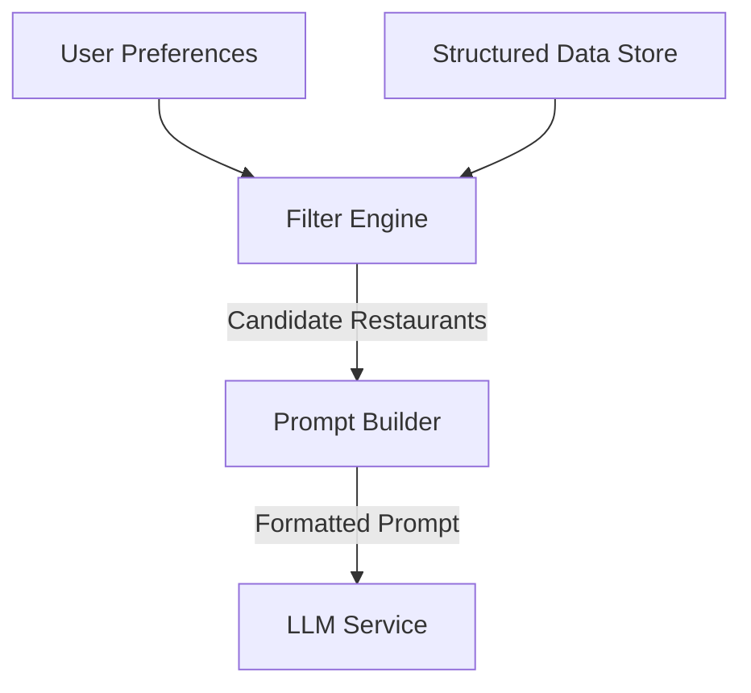
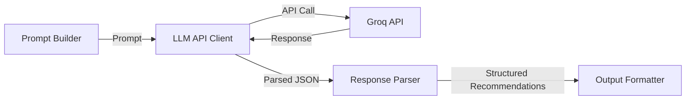
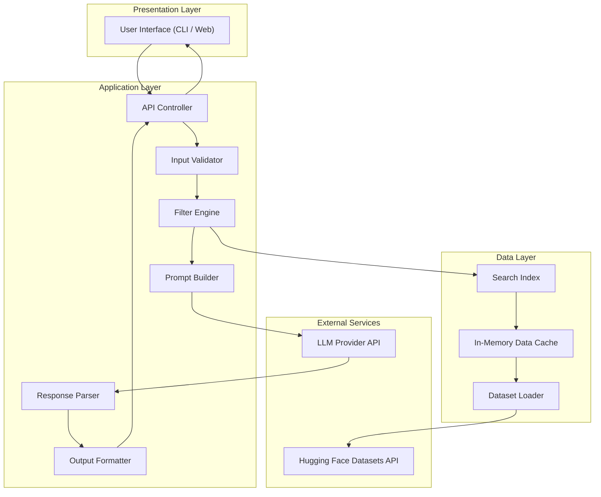
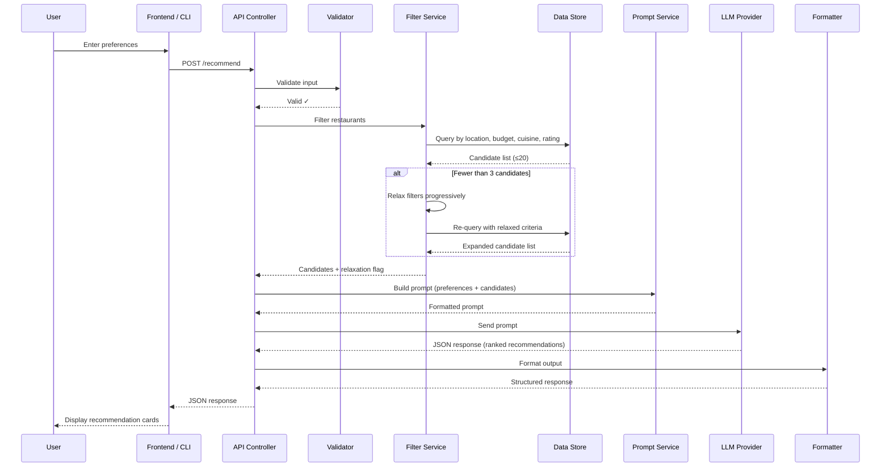

# Architecture: AI-Powered Restaurant Recommendation System

> **Project:** Nextleap Zomato
> **Version:** 1.0
> **Last Updated:** 2026-06-24
> **Source:** [context.md](file:///c:/Users/KAUSTUBH/Downloads/Nextleap%20Zomato/Docs/context.md)

---

## 1. System Overview

The system is an AI-powered restaurant recommendation service inspired by Zomato. It combines **structured restaurant data** from a public Hugging Face dataset with a **Large Language Model (LLM)** to deliver personalized, explainable restaurant recommendations.

### High-Level Flow



---

## 2. Architecture Style

The system follows a **modular monolith** architecture with clearly separated layers that can be independently evolved into microservices if needed.

| Layer | Responsibility |
|---|---|
| **Presentation** | User interface for collecting preferences and displaying results |
| **API / Controller** | Request handling, validation, and response formatting |
| **Service** | Business logic — filtering, prompt engineering, orchestration |
| **Data Access** | Dataset loading, preprocessing, querying |
| **External Integration** | LLM API communication |

---

## 3. Component Architecture

### 3.1 Data Ingestion Module

**Purpose:** Load, preprocess, and index the Zomato restaurant dataset.



**Responsibilities:**
- Fetch dataset from [ManikaSaini/zomato-restaurant-recommendation](https://huggingface.co/datasets/ManikaSaini/zomato-restaurant-recommendation)
- Clean and normalize fields (handle missing values, standardize formats)
- Extract and retain relevant fields:

| Field | Type | Description |
|---|---|---|
| `name` | `string` | Restaurant name |
| `location` | `string` | City / area (e.g., Delhi, Bangalore) |
| `cuisines` | `string[]` | List of cuisines served |
| `cost_for_two` | `number` | Average cost for two people (INR) |
| `rating` | `float` | Aggregate rating (0.0 – 5.0) |
| `votes` | `integer` | Number of votes / reviews |
| `restaurant_type` | `string` | Dine-in, delivery, café, etc. |
| `highlights` | `string[]` | Features (e.g., "Family Friendly", "Live Music") |

**Design Decisions:**
- Dataset is loaded **once at startup** and cached in memory (or as a local file) to avoid repeated API calls.
- A lightweight indexing strategy (e.g., dictionaries/hashmaps by location and cuisine) enables fast filtering without a database.

---

### 3.2 User Input Module

**Purpose:** Collect, validate, and normalize user preferences.

**Input Schema:**

```json
{
  "location": "string (required)",
  "budget": "string (required) — 'low' | 'medium' | 'high'",
  "cuisine": "string (optional) — e.g., 'Italian', 'Chinese'",
  "min_rating": "float (optional, default: 0.0) — 0.0 to 5.0",
  "additional_preferences": "string (optional) — free text e.g., 'family-friendly, quick service'"
}
```

**Budget Mapping:**

| Budget Tier | Estimated Cost for Two (INR) |
|---|---|
| Low | ≤ ₹500 |
| Medium | ₹501 – ₹1500 |
| High | > ₹1500 |

> [!NOTE]
> Budget thresholds should be configurable via environment variables or a config file so they can be tuned based on dataset analysis.

**Validation Rules:**
- `location` must match a known city/area in the dataset
- `budget` must be one of the defined tiers
- `min_rating` must be between 0.0 and 5.0
- `cuisine` is validated against the set of cuisines present in the dataset

---

### 3.3 Integration Layer (Filter & Prompt Engine)

**Purpose:** Bridge between raw data and the LLM — filters restaurants and constructs effective prompts.



#### 3.3.1 Filter Engine

Applies cascading filters on the dataset:

1. **Location filter** — exact match on city/area
2. **Budget filter** — cost_for_two within the selected tier range
3. **Cuisine filter** — intersection with user's preferred cuisine(s)
4. **Rating filter** — rating ≥ user's minimum rating
5. **Soft match** — keyword matching on `highlights` for additional preferences

**Output:** Top N candidate restaurants (configurable, default = 20) sorted by rating descending.

> [!IMPORTANT]
> If fewer than 3 candidates remain after filtering, relax filters progressively (first drop `additional_preferences`, then broaden `budget` by one tier) and inform the user about relaxed criteria.

#### 3.3.2 Prompt Builder

Constructs a structured prompt for the LLM:

```
System: You are an expert restaurant recommendation assistant. 
Analyze the following restaurants and rank them for the user based on 
their preferences. For each recommendation, explain WHY it's a good fit.

User Preferences:
- Location: {location}
- Budget: {budget}
- Cuisine: {cuisine}
- Minimum Rating: {min_rating}
- Additional: {additional_preferences}

Candidate Restaurants:
{formatted_restaurant_list}

Instructions:
1. Rank the top 5 restaurants that best match the user's preferences.
2. For each restaurant, provide:
   - Restaurant Name
   - Cuisine(s)
   - Rating
   - Estimated Cost for Two
   - A 2-3 sentence explanation of why this restaurant is recommended.
3. If some preferences couldn't be fully matched, mention that.

Respond in valid JSON format.
```

---

### 3.4 Recommendation Engine (LLM Service)

**Purpose:** Use an LLM to intelligently rank, explain, and summarize restaurant options.



**Responsibilities:**
- Send the constructed prompt to the LLM API
- Parse the LLM response into structured recommendation objects
- Handle API errors, rate limits, and timeouts gracefully
- Validate the response schema before passing downstream

**LLM Response Schema:**

```json
{
  "recommendations": [
    {
      "rank": 1,
      "name": "Restaurant Name",
      "cuisines": ["Italian", "Continental"],
      "rating": 4.5,
      "cost_for_two": 1200,
      "explanation": "This restaurant is perfect for..."
    }
  ],
  "summary": "Based on your preferences, here are the top picks...",
  "filters_relaxed": false
}
```

> [!TIP]
> Request JSON output from Groq (using `response_format: { type: "json_object" }`) to avoid brittle text parsing. Groq's API is OpenAI-compatible, so the same parameter works.

---

### 3.5 Output Display Module

**Purpose:** Present recommendations in a clear, user-friendly format.

**Output Fields per Recommendation:**

| Field | Source |
|---|---|
| Restaurant Name | Dataset + LLM ranking |
| Cuisine | Dataset |
| Rating | Dataset |
| Estimated Cost | Dataset |
| AI-generated Explanation | LLM |

**Display Modes:**
- **CLI Mode:** Formatted table/card output in terminal
- **Web Mode:** Styled cards with restaurant details and AI explanations (if a frontend is built)

---

## 4. System Architecture Diagram



---

## 5. Technology Stack (Recommended)

| Component | Technology | Rationale |
|---|---|---|
| **Language** | Python 3.10+ | Rich ML/AI ecosystem, Hugging Face SDK |
| **Dataset Loading** | `datasets` (Hugging Face) | Native integration with the data source |
| **Data Processing** | `pandas` | Efficient filtering, sorting, and data manipulation |
| **LLM Integration** | `groq` Python SDK | Groq provides ultra-fast inference with OpenAI-compatible API; supports JSON mode |
| **Web Framework** | `FastAPI` or `Streamlit` | FastAPI for API-first; Streamlit for rapid prototyping |
| **Frontend (optional)** | HTML/CSS/JS or React | For a polished web UI |
| **Config Management** | `.env` + `python-dotenv` | Secure API key and config management |
| **Testing** | `pytest` | Standard Python testing framework |

---

## 6. API Contract

### `POST /recommend`

**Request Body:**

```json
{
  "location": "Bangalore",
  "budget": "medium",
  "cuisine": "Italian",
  "min_rating": 4.0,
  "additional_preferences": "family-friendly, rooftop"
}
```

**Response Body:**

```json
{
  "status": "success",
  "count": 5,
  "filters_relaxed": false,
  "recommendations": [
    {
      "rank": 1,
      "name": "Trattoria",
      "cuisines": ["Italian", "Continental"],
      "rating": 4.6,
      "cost_for_two": 1200,
      "explanation": "Trattoria is an excellent match for your Italian cuisine preference with a 4.6 rating. Known for its family-friendly atmosphere and rooftop seating, it fits perfectly within your medium budget at ₹1200 for two."
    }
  ],
  "summary": "Based on your preferences for Italian cuisine in Bangalore..."
}
```

**Error Response:**

```json
{
  "status": "error",
  "code": "INVALID_LOCATION",
  "message": "Location 'XYZ' not found in the dataset. Available locations: [...]"
}
```

---

## 7. Proposed Directory Structure

```
Nextleap Zomato/
├── Docs/
│   ├── ProblemStatement.txt        # Original problem statement
│   ├── context.md                  # Project context document
│   └── architecture.md             # This file
├── src/
│   ├── __init__.py
│   ├── main.py                     # Application entry point
│   ├── config.py                   # Configuration & environment variables
│   ├── data/
│   │   ├── __init__.py
│   │   ├── loader.py               # Hugging Face dataset loader
│   │   └── preprocessor.py         # Data cleaning & normalization
│   ├── models/
│   │   ├── __init__.py
│   │   ├── restaurant.py           # Restaurant data model
│   │   ├── user_preferences.py     # User input model & validation
│   │   └── recommendation.py       # Recommendation response model
│   ├── services/
│   │   ├── __init__.py
│   │   ├── filter_service.py       # Filtering & candidate selection
│   │   ├── prompt_service.py       # Prompt construction
│   │   ├── llm_service.py          # LLM API integration
│   │   └── recommendation_service.py  # Orchestrator
│   └── api/
│       ├── __init__.py
│       └── routes.py               # API endpoint definitions
├── tests/
│   ├── test_loader.py
│   ├── test_filter.py
│   ├── test_prompt.py
│   └── test_recommendation.py
├── .env.example                    # Environment variable template
├── requirements.txt                # Python dependencies
└── README.md                       # Project README
```

---

## 8. Data Flow (End-to-End)



---

## 9. Error Handling Strategy

| Scenario | Handling |
|---|---|
| Invalid user input | Return 400 with descriptive validation errors |
| No restaurants match filters | Relax filters progressively; inform user |
| LLM API timeout | Retry once with exponential backoff; fallback to data-only ranking |
| LLM returns malformed JSON | Retry prompt with stricter format instructions; log error |
| LLM rate limit exceeded | Queue request; return 429 with retry-after header |
| Dataset unavailable | Use cached local copy; alert on startup if stale |

---

## 10. Configuration

All sensitive and tunable values are managed via environment variables:

```env
# LLM Configuration (Groq)
LLM_PROVIDER=groq
GROQ_API_KEY=gsk_...
LLM_MODEL=llama-3.3-70b-versatile   # or mixtral-8x7b-32768, gemma2-9b-it
LLM_MAX_TOKENS=2048
LLM_TEMPERATURE=0.7

# Dataset
HF_DATASET_ID=ManikaSaini/zomato-restaurant-recommendation
DATA_CACHE_DIR=./data/cache

# Filtering
MAX_CANDIDATES=20
BUDGET_LOW_MAX=500
BUDGET_MEDIUM_MAX=1500

# Server
HOST=0.0.0.0
PORT=8000
DEBUG=false
```

---

## 11. Security Considerations

| Concern | Mitigation |
|---|---|
| API key exposure | Store in `.env`, never commit to version control |
| Prompt injection | Sanitize user input before injecting into prompts |
| Rate limiting | Implement request throttling on the API layer |
| Data privacy | No user data is stored; stateless request/response |

---

## 12. Future Enhancements

| Enhancement | Description |
|---|---|
| **User Accounts** | Save preferences and recommendation history |
| **Feedback Loop** | Allow users to rate recommendations to improve future results |
| **Multi-turn Conversation** | Refine recommendations through follow-up questions |
| **Caching Layer** | Cache LLM responses for identical queries (Redis) |
| **Vector Search** | Use embeddings for semantic matching on restaurant descriptions |
| **Real-time Data** | Integrate live Zomato API for current menus, wait times, offers |

---

## References

- [Problem Statement](file:///c:/Users/KAUSTUBH/Downloads/Nextleap%20Zomato/Docs/ProblemStatement.txt)
- [Project Context](file:///c:/Users/KAUSTUBH/Downloads/Nextleap%20Zomato/Docs/context.md)
- [Zomato Dataset on Hugging Face](https://huggingface.co/datasets/ManikaSaini/zomato-restaurant-recommendation)
