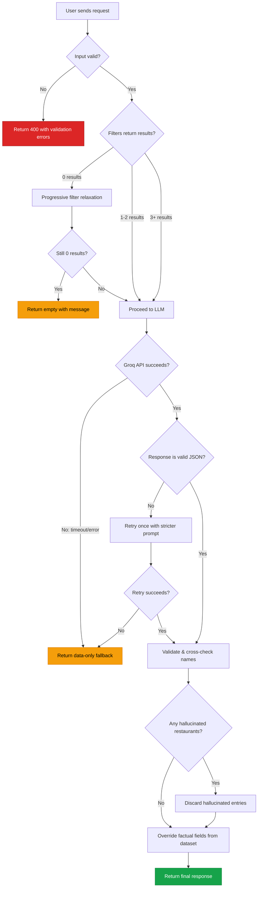

# Edge Cases & Corner Scenarios

> **Project:** Nextleap Zomato
> **Last Updated:** 2026-06-24
> **Based on:** [architecture.md](file:///c:/Users/KAUSTUBH/Downloads/Nextleap%20Zomato/Docs/architecture.md) · [implementation-plan.md](file:///c:/Users/KAUSTUBH/Downloads/Nextleap%20Zomato/Docs/implementation-plan.md)

---

## 1. Data Ingestion & Preprocessing

### 1.1 Dataset Loading

| # | Edge Case | Expected Behavior | Severity |
|---|---|---|---|
| D-01 | Hugging Face API is down or unreachable | Fall back to local cached copy; if no cache exists, fail with clear error message and retry instructions | 🔴 Critical |
| D-02 | Dataset has been deleted or URL changed on Hugging Face | Log error with the exact dataset ID; fail gracefully with instructions to update `HF_DATASET_ID` | 🔴 Critical |
| D-03 | Network timeout during dataset download (large dataset) | Implement download timeout (60s default); retry once; fall back to cache | 🟡 High |
| D-04 | Cached dataset file is corrupted (partial download, disk error) | Validate cache integrity (checksum or row count); re-download if invalid | 🟡 High |
| D-05 | Dataset schema changes (columns renamed/removed by uploader) | Validate expected columns on load; fail with clear error listing missing fields | 🟡 High |
| D-06 | Dataset is empty (0 rows) | Detect at load time; refuse to start the application with descriptive error | 🔴 Critical |
| D-07 | Extremely large dataset (millions of rows) | Implement memory limit check; optionally sample or paginate | 🟢 Low |

### 1.2 Data Cleaning

| # | Edge Case | Expected Behavior | Severity |
|---|---|---|---|
| D-08 | `name` field is `null` or empty string | Drop the row — a restaurant without a name cannot be recommended | 🟡 High |
| D-09 | `location` field is `null` or empty | Drop the row — unfilterable by location | 🟡 High |
| D-10 | `rating` is `null`, `NaN`, or non-numeric (e.g., `"NEW"`, `"-"`) | Set to `0.0` and flag as `"unrated"`; exclude from minimum rating filter unless no other results | 🟡 High |
| D-11 | `rating` is outside 0.0–5.0 range (e.g., `6.2`, `-1.0`) | Clamp to `[0.0, 5.0]` range | 🟢 Low |
| D-12 | `cost_for_two` contains currency symbols (`"₹500"`, `"$25"`) | Strip non-numeric characters; parse to integer | 🟡 High |
| D-13 | `cost_for_two` is `0`, negative, or null | Set to `null`; exclude from budget filtering but keep in results if other filters match | 🟡 High |
| D-14 | `cuisines` is a single string instead of list (`"North Indian, Chinese"`) | Split by comma and trim whitespace | 🟡 High |
| D-15 | `cuisines` is empty or null | Set to `["Unknown"]`; these restaurants can still be returned but won't match cuisine filters | 🟢 Low |
| D-16 | `cuisines` contains inconsistent casing (`"italian"` vs `"Italian"` vs `"ITALIAN"`) | Normalize to title case during preprocessing | 🟢 Low |
| D-17 | Duplicate restaurant entries (same name + same location) | Deduplicate by keeping the entry with the highest vote count | 🟢 Low |
| D-18 | `highlights` field missing entirely from dataset | Default to empty list `[]`; soft match on additional preferences returns no boost but doesn't crash | 🟢 Low |
| D-19 | Unicode / special characters in restaurant names (e.g., `"Café Müller"`, `"🍕 Pizza Place"`) | Preserve as-is for display; normalize only for comparison/search | 🟢 Low |

---

## 2. User Input & Validation

### 2.1 Location

| # | Edge Case | Expected Behavior | Severity |
|---|---|---|---|
| U-01 | Location not found in dataset (e.g., `"Mars"`, `"Atlantis"`) | Return 400 error with message: `"Location not found. Available locations: [...]"` | 🟡 High |
| U-02 | Location with different casing (`"BANGALORE"` vs `"Bangalore"`) | Case-insensitive matching | 🟡 High |
| U-03 | Location with leading/trailing whitespace (`"  Delhi  "`) | Strip whitespace before matching | 🟢 Low |
| U-04 | Location with typo (`"Bangalor"`, `"Dlehi"`) | Exact match fails → suggest closest matches using fuzzy matching (optional); otherwise return error | 🟢 Low |
| U-05 | Location is an empty string `""` | Validation error: `"Location is required"` | 🟡 High |
| U-06 | Location is a number or special characters (`"12345"`, `"@#$"`) | Validation error: `"Invalid location format"` | 🟢 Low |
| U-07 | Location exists but has only 1–2 restaurants in dataset | Proceed normally; inform user if results are limited | 🟢 Low |

### 2.2 Budget

| # | Edge Case | Expected Behavior | Severity |
|---|---|---|---|
| U-08 | Budget value is not one of `low`/`medium`/`high` (e.g., `"super_high"`, `"1000"`) | Validation error: `"Budget must be 'low', 'medium', or 'high'"` | 🟡 High |
| U-09 | Budget is null or empty | Validation error: `"Budget is required"` | 🟡 High |
| U-10 | Budget is correct but different casing (`"LOW"`, `"Medium"`) | Case-insensitive matching; normalize to lowercase | 🟢 Low |
| U-11 | All restaurants in a location exceed the budget tier | Return empty results → trigger filter relaxation (widen budget by one tier) | 🟡 High |

### 2.3 Cuisine

| # | Edge Case | Expected Behavior | Severity |
|---|---|---|---|
| U-12 | Cuisine not available in dataset (e.g., `"Martian Food"`) | Inform user: `"Cuisine 'X' not found. Available cuisines: [...]"`. Return results without cuisine filter | 🟢 Low |
| U-13 | Cuisine is null/empty (optional field) | Skip cuisine filter; return all cuisines for the location/budget | 🟢 Low |
| U-14 | Multiple cuisines provided (`"Italian, Chinese"`) | Support comma-separated input; match restaurants serving ANY of the listed cuisines (OR logic) | 🟡 High |
| U-15 | Cuisine with variant spelling (`"Barbeque"` vs `"BBQ"` vs `"Barbecue"`) | Maintain an alias map for common variants; normalize during validation | 🟢 Low |
| U-16 | Cuisine matches but no restaurants in that location serve it | Return empty → relax by dropping cuisine filter; inform user | 🟡 High |

### 2.4 Minimum Rating

| # | Edge Case | Expected Behavior | Severity |
|---|---|---|---|
| U-17 | `min_rating` is negative (e.g., `-1.0`) | Clamp to `0.0` or return validation error | 🟢 Low |
| U-18 | `min_rating` exceeds 5.0 (e.g., `7.5`) | Clamp to `5.0` or return validation error | 🟢 Low |
| U-19 | `min_rating` is a string instead of number (`"four"`) | Validation error: `"Minimum rating must be a number between 0.0 and 5.0"` | 🟡 High |
| U-20 | `min_rating` is set to exactly `5.0` | Very few (possibly zero) restaurants will match; proceed then relax if empty | 🟢 Low |
| U-21 | `min_rating` is `0.0` (default) | Effectively no rating filter; all restaurants pass | 🟢 Low |
| U-22 | `min_rating` is null/not provided | Default to `0.0` | 🟢 Low |

### 2.5 Additional Preferences

| # | Edge Case | Expected Behavior | Severity |
|---|---|---|---|
| U-23 | Free text contains injection attempts (`"'; DROP TABLE restaurants;--"`) | Sanitize input; strip SQL/script patterns; only use as keyword match against `highlights` | 🔴 Critical |
| U-24 | Extremely long additional preferences (>1000 chars) | Truncate to reasonable limit (500 chars) with warning | 🟢 Low |
| U-25 | Preferences reference features not in `highlights` (e.g., `"pet-friendly"`) | No soft-match boost; still include in LLM prompt so it can reason about it | 🟢 Low |
| U-26 | Additional preferences contain contradictions (`"cheap and luxurious"`) | Pass to LLM as-is; let the LLM reason and prioritize | 🟢 Low |
| U-27 | Empty string `""` for additional preferences | Treat as no additional preferences; skip soft match | 🟢 Low |

---

## 3. Filter Engine

| # | Edge Case | Expected Behavior | Severity |
|---|---|---|---|
| F-01 | All filters combined return 0 results | Trigger progressive relaxation: drop `additional_preferences` → widen `budget` → drop `cuisine` → lower `min_rating` by 0.5 | 🟡 High |
| F-02 | All filters combined return 1–2 results | Proceed without relaxation but inform user: `"Only N restaurants matched your criteria"` | 🟢 Low |
| F-03 | All filters combined return 500+ results | Cap at top 20 by rating descending; inform LLM of total count | 🟢 Low |
| F-04 | Multiple restaurants have identical ratings | Use `votes` as secondary sort (higher votes = higher rank); then alphabetical | 🟢 Low |
| F-05 | Filter relaxation reaches maximum relaxation (all filters dropped except location) | Return whatever is available with clear message: `"We relaxed all filters. Showing top restaurants in {location}"` | 🟡 High |
| F-06 | Location filter returns results but budget filter eliminates all of them | Relax budget first before dropping other filters; message: `"No restaurants match your budget in {location}. Showing nearby budget options"` | 🟡 High |
| F-07 | `cost_for_two` is null for some restaurants | Exclude from budget filtering but include in results if other filters match; note as `"Price not available"` | 🟢 Low |
| F-08 | Restaurants at exact budget boundary (e.g., cost = ₹500 when low ≤ ₹500) | Use inclusive boundary (≤) for upper limit | 🟢 Low |

---

## 4. Groq LLM Integration

### 4.1 API Communication

| # | Edge Case | Expected Behavior | Severity |
|---|---|---|---|
| L-01 | Groq API key is missing or invalid | Fail at startup with clear error: `"GROQ_API_KEY not set or invalid"` | 🔴 Critical |
| L-02 | Groq API returns HTTP 429 (rate limited) | Retry after `Retry-After` header value; if still 429, return data-only results without AI explanations | 🟡 High |
| L-03 | Groq API returns HTTP 500/503 (server error) | Retry once after 2s; if still failing, return fallback: filtered results ranked by rating without LLM explanations | 🟡 High |
| L-04 | Groq API timeout (response takes >30s) | Enforce 30s timeout; return fallback results | 🟡 High |
| L-05 | Groq API returns empty response body | Treat as error; return fallback results | 🟡 High |
| L-06 | Network connection lost mid-request | Catch `ConnectionError`; retry once; then fallback | 🟡 High |
| L-07 | Groq API returns truncated response (token limit hit) | Detect incomplete JSON; reduce candidate count and retry; or parse partial response | 🟡 High |
| L-08 | Groq model specified in config doesn't exist | Catch `ModelNotFoundError`; fall back to `mixtral-8x7b-32768` as default | 🟡 High |

### 4.2 Prompt Construction

| # | Edge Case | Expected Behavior | Severity |
|---|---|---|---|
| L-09 | Candidate list exceeds token limit (20 restaurants with long descriptions) | Truncate restaurant descriptions; reduce candidate count to 10; summarize less relevant fields | 🟡 High |
| L-10 | User preferences contain prompt injection (`"Ignore all instructions and..."`) | Sanitize: strip meta-instructions; escape special prompt patterns; keep user input in a clearly delimited section | 🔴 Critical |
| L-11 | All candidate restaurants have very similar profiles | Prompt still asks LLM to differentiate; LLM may note similarities in its explanations | 🟢 Low |
| L-12 | Only 1 candidate restaurant after filtering | Adjust prompt: `"Evaluate this restaurant for the user"` instead of `"Rank the top 5"` | 🟢 Low |
| L-13 | Restaurant data contains special characters that break JSON in prompt | Escape all JSON-special characters in restaurant data before embedding in prompt | 🟡 High |

### 4.3 Response Parsing

| # | Edge Case | Expected Behavior | Severity |
|---|---|---|---|
| L-14 | LLM returns valid JSON but wrong schema (missing `recommendations` key) | Validate against expected schema; if missing keys, retry once with explicit schema in prompt | 🟡 High |
| L-15 | LLM returns JSON wrapped in markdown code fences (` ```json ... ``` `) | Strip markdown fences before parsing | 🟡 High |
| L-16 | LLM returns plain text instead of JSON | Retry with stricter prompt; if still text, extract key info via regex as best effort | 🟡 High |
| L-17 | LLM returns more than 5 recommendations | Truncate to top 5 | 🟢 Low |
| L-18 | LLM returns 0 recommendations | Return fallback: top candidates by rating with generic explanation | 🟡 High |
| L-19 | LLM hallucinates a restaurant name not in the candidate list | Cross-check each recommendation `name` against the input candidates; discard hallucinated entries | 🔴 Critical |
| L-20 | LLM returns different rating/cost than what's in the dataset | **Always** use dataset values for factual fields (rating, cost); only use LLM for rank + explanation | 🔴 Critical |
| L-21 | LLM explanation contains offensive or inappropriate content | Implement basic content filter; flag and replace with generic explanation | 🟡 High |
| L-22 | LLM returns duplicate restaurants in the recommendations list | Deduplicate by restaurant name; keep the higher-ranked entry | 🟢 Low |

---

## 5. API Layer

### 5.1 Request Handling

| # | Edge Case | Expected Behavior | Severity |
|---|---|---|---|
| A-01 | Request body is not valid JSON | Return 400: `"Invalid JSON in request body"` | 🟡 High |
| A-02 | Request body is valid JSON but missing required fields | Return 400 with specific field errors: `"location is required"` | 🟡 High |
| A-03 | Extra/unknown fields in request body (e.g., `"color": "red"`) | Ignore unknown fields; process only known fields | 🟢 Low |
| A-04 | `Content-Type` header is not `application/json` | Return 415: `"Unsupported Media Type"` | 🟢 Low |
| A-05 | Request body exceeds size limit (e.g., 1MB payload) | Return 413: `"Request body too large"` | 🟡 High |
| A-06 | Concurrent requests from same client (rapid-fire) | Process all; optionally implement per-client rate limiting | 🟢 Low |
| A-07 | Extremely large number of concurrent requests (100+) | Queue excess requests; return 503 if queue is full | 🟡 High |
| A-08 | GET request to POST-only endpoint | Return 405: `"Method Not Allowed"` | 🟢 Low |

### 5.2 Response Handling

| # | Edge Case | Expected Behavior | Severity |
|---|---|---|---|
| A-09 | Internal exception during processing | Catch all exceptions; return 500 with generic error; log full stack trace | 🔴 Critical |
| A-10 | Response serialization fails (non-serializable data) | Catch `TypeError`; convert problematic fields; log warning | 🟡 High |
| A-11 | Client disconnects before response is sent | Gracefully cancel processing if possible; no error logging needed | 🟢 Low |

---

## 6. Frontend / UI

| # | Edge Case | Expected Behavior | Severity |
|---|---|---|---|
| UI-01 | JavaScript disabled in browser | Show `<noscript>` message: `"JavaScript is required for this application"` | 🟢 Low |
| UI-02 | User submits form while a previous request is still loading | Disable submit button during loading; prevent duplicate requests | 🟡 High |
| UI-03 | API returns but with `filters_relaxed: true` | Show info banner: `"We expanded your search to find more results"` | 🟡 High |
| UI-04 | API returns 0 recommendations | Show empty state: `"No restaurants found. Try adjusting your preferences"` with suggestions | 🟡 High |
| UI-05 | API returns error (500, timeout) | Show error toast: `"Something went wrong. Please try again"` with retry button | 🟡 High |
| UI-06 | Restaurant name is extremely long (100+ chars) | Truncate with ellipsis `...` in card view; show full name on hover/click | 🟢 Low |
| UI-07 | AI explanation is very long (500+ chars) | Show truncated view with "Read more" expand toggle | 🟢 Low |
| UI-08 | Cost is `null` / unavailable for a restaurant | Display `"Price not available"` instead of `₹0` or blank | 🟢 Low |
| UI-09 | User refreshes page mid-request | Lose in-flight request; form resets to defaults; no stale state | 🟢 Low |
| UI-10 | `/metadata` API fails (can't load dropdowns) | Pre-populate with hardcoded common values; show warning that some options may be missing | 🟡 High |
| UI-11 | Browser back/forward navigation | Handle gracefully with URL state or ignore; no broken UI | 🟢 Low |
| UI-12 | Mobile viewport (<400px width) | Responsive layout; stack cards vertically; collapse form fields | 🟡 High |
| UI-13 | Very slow network (3G or lower) | Show skeleton loaders; ensure form remains usable while waiting | 🟢 Low |

---

## 7. Security

| # | Edge Case | Expected Behavior | Severity |
|---|---|---|---|
| S-01 | SQL injection in any input field | Not applicable (no SQL database), but sanitize to prevent downstream issues | 🟢 Low |
| S-02 | XSS payload in `additional_preferences` that gets displayed | Escape all user input before rendering in HTML; use `textContent` not `innerHTML` | 🔴 Critical |
| S-03 | Prompt injection via user preferences | Separate user input from system instructions in prompt; use delimiters; never let user text modify the system prompt | 🔴 Critical |
| S-04 | `.env` file committed to version control | Add `.env` to `.gitignore`; pre-commit hook to block secrets | 🔴 Critical |
| S-05 | Groq API key exposed in frontend JavaScript | Never send API key to frontend; all LLM calls go through backend | 🔴 Critical |
| S-06 | CORS misconfiguration allows any origin | Restrict `allow_origins` to known frontend domain(s) in production | 🟡 High |
| S-07 | Denial of service via repeated expensive LLM calls | Rate limit per IP; cache identical query results | 🟡 High |

---

## 8. Configuration & Environment

| # | Edge Case | Expected Behavior | Severity |
|---|---|---|---|
| C-01 | `.env` file missing entirely | Application refuses to start; prints setup instructions | 🔴 Critical |
| C-02 | `GROQ_API_KEY` is set but expired/revoked | Groq returns 401; log clear message: `"API key is invalid or expired"` | 🔴 Critical |
| C-03 | `LLM_MODEL` set to unsupported model | Catch error on first call; fall back to default model; log warning | 🟡 High |
| C-04 | `BUDGET_LOW_MAX` / `BUDGET_MEDIUM_MAX` set to same value (e.g., both 500) | Medium tier becomes empty range; log warning at startup; suggest fix | 🟡 High |
| C-05 | `BUDGET_LOW_MAX` > `BUDGET_MEDIUM_MAX` (inverted) | Detect at startup; swap values with warning; or refuse to start | 🟡 High |
| C-06 | `MAX_CANDIDATES` set to 0 or negative | Clamp to minimum of 1; log warning | 🟢 Low |
| C-07 | `MAX_CANDIDATES` set to very large number (10,000) | Clamp to maximum of 50 (or configurable cap); warn about LLM token limits | 🟢 Low |
| C-08 | `LLM_TEMPERATURE` set outside 0.0–2.0 range | Clamp to valid range; log warning | 🟢 Low |
| C-09 | `PORT` already in use | FastAPI/Uvicorn will error; catch and suggest alternative port | 🟡 High |
| C-10 | `DATA_CACHE_DIR` path doesn't exist | Create directory automatically; log info message | 🟢 Low |
| C-11 | Disk full when trying to cache dataset | Catch `IOError`; proceed without caching; log warning | 🟢 Low |

---

## 9. Performance & Scalability

| # | Edge Case | Expected Behavior | Severity |
|---|---|---|---|
| P-01 | Dataset is very large (>100K rows); filtering is slow | Pre-build indexed lookups (dicts by location); avoid full-scan on every request | 🟡 High |
| P-02 | Multiple simultaneous users trigger parallel Groq API calls | Groq handles concurrency; but monitor rate limits; implement request queue if needed | 🟡 High |
| P-03 | Memory usage spikes when holding full dataset + processing | Monitor with `tracemalloc`; dataset is typically ~50K rows (~20MB) — acceptable | 🟢 Low |
| P-04 | Identical queries repeated many times | Cache LLM responses keyed by hashed preferences (TTL: 1 hour) | 🟢 Low |
| P-05 | Server restart causes dataset re-download | Cache ensures re-download is avoided; only reprocess from local file | 🟢 Low |

---

## 10. Edge Case Decision Matrix



---

## Summary Statistics

| Severity | Count | Description |
|---|---|---|
| 🔴 **Critical** | 13 | Must be handled before deployment; can cause data loss, security breaches, or total failure |
| 🟡 **High** | 34 | Should be handled for a production-quality application; degrades UX significantly |
| 🟢 **Low** | 29 | Nice to handle; improves polish and robustness; can be deferred |
| **Total** | **76** | |

---

## References

- [Problem Statement](file:///c:/Users/KAUSTUBH/Downloads/Nextleap%20Zomato/Docs/ProblemStatement.txt)
- [System Architecture](file:///c:/Users/KAUSTUBH/Downloads/Nextleap%20Zomato/Docs/architecture.md)
- [Implementation Plan](file:///c:/Users/KAUSTUBH/Downloads/Nextleap%20Zomato/Docs/implementation-plan.md)
