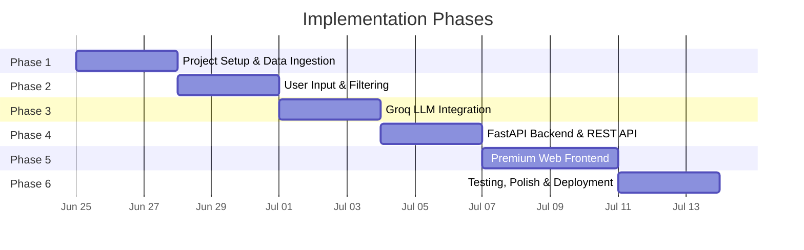
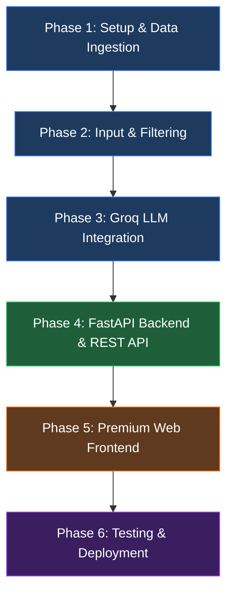

# Implementation Plan: AI-Powered Restaurant Recommendation System

> **Project:** Nextleap Zomato
> **Version:** 1.0
> **Last Updated:** 2026-06-24
> **Based on:** [architecture.md](file:///c:/Users/KAUSTUBH/Downloads/Nextleap%20Zomato/Docs/architecture.md) · [context.md](file:///c:/Users/KAUSTUBH/Downloads/Nextleap%20Zomato/Docs/context.md)

---

## Overview

This plan breaks the project into **5 phases**, each producing a working, testable increment. Phases are ordered by dependency — later phases build on earlier ones.



---

## Phase 1 — Project Setup & Data Ingestion

> **Goal:** Establish the project skeleton and load the Zomato dataset into a clean, query-ready format.
> **Duration:** ~2–3 days
> **Depends on:** Nothing (starting point)

### 1.1 Project Scaffolding

| Task | Details |
|---|---|
| Create directory structure | Follow the layout defined in [architecture.md §7](file:///c:/Users/KAUSTUBH/Downloads/Nextleap%20Zomato/Docs/architecture.md#L348) |
| Initialize Python environment | `python -m venv venv` + `requirements.txt` |
| Install core dependencies | `datasets`, `pandas`, `python-dotenv` |
| Create `.env.example` | Template with all config keys (see [architecture.md §10](file:///c:/Users/KAUSTUBH/Downloads/Nextleap%20Zomato/Docs/architecture.md#L449)) |
| Set up `config.py` | Load environment variables using `dotenv` |

**Files to create:**

```
src/__init__.py
src/main.py
src/config.py
.env.example
requirements.txt
README.md
```

### 1.2 Dataset Loader (`src/data/loader.py`)

| Task | Details |
|---|---|
| Fetch dataset | Use `datasets.load_dataset("ManikaSaini/zomato-restaurant-recommendation")` |
| Convert to DataFrame | `dataset.to_pandas()` for efficient manipulation |
| Local caching | Save to `DATA_CACHE_DIR` on first load; read from cache on subsequent runs |
| Startup loading | Load once at application boot, hold in memory |

### 1.3 Data Preprocessor (`src/data/preprocessor.py`)

| Task | Details |
|---|---|
| Handle missing values | Drop or fill nulls in critical fields (`name`, `location`, `rating`) |
| Normalize text fields | Lowercase and strip whitespace for `location`, `cuisines` |
| Parse `cuisines` field | Split comma-separated string → `list[str]` |
| Standardize `cost_for_two` | Convert to numeric; handle currency symbols / non-numeric entries |
| Standardize `rating` | Convert to float; clamp to 0.0–5.0 range |
| Extract `highlights` | Parse into list if present; default to empty list |
| Build search index | Create dictionaries keyed by `location` and `cuisine` for O(1) lookups |

### 1.4 Restaurant Data Model (`src/models/restaurant.py`)

| Task | Details |
|---|---|
| Define `Restaurant` dataclass/Pydantic model | Fields: `name`, `location`, `cuisines`, `cost_for_two`, `rating`, `votes`, `restaurant_type`, `highlights` |
| Add serialization | `.to_dict()` / `.to_prompt_string()` for LLM integration later |

### Phase 1 — Deliverables

- [x] Project runs with `python src/main.py`
- [x] Dataset loads successfully from Hugging Face (or cache)
- [x] Cleaned DataFrame printed to console with correct types
- [x] Search index built and queryable

### Phase 1 — Verification

```bash
# Run the loader and print dataset stats
python -c "from src.data.loader import load_data; df = load_data(); print(df.info()); print(df.head())"
```

---

## Phase 2 — User Input & Filter Engine

> **Goal:** Accept user preferences, validate them, and filter the dataset to produce a shortlist of candidate restaurants.
> **Duration:** ~2–3 days
> **Depends on:** Phase 1 (dataset loaded and indexed)

### 2.1 User Preferences Model (`src/models/user_preferences.py`)

| Task | Details |
|---|---|
| Define `UserPreferences` model | Fields: `location` (required), `budget` (required), `cuisine` (optional), `min_rating` (optional, default 0.0), `additional_preferences` (optional) |
| Budget enum | `low`, `medium`, `high` with configurable thresholds from `.env` |
| Validation logic | Location must exist in dataset; rating must be 0.0–5.0; cuisine validated against dataset values |
| Error messages | Clear, user-friendly validation error messages |

**Budget Mapping (from [architecture.md §3.2](file:///c:/Users/KAUSTUBH/Downloads/Nextleap%20Zomato/Docs/architecture.md#L96)):**

| Tier | Cost for Two |
|---|---|
| Low | ≤ ₹500 |
| Medium | ₹501 – ₹1500 |
| High | > ₹1500 |

### 2.2 Filter Service (`src/services/filter_service.py`)

| Task | Details |
|---|---|
| Location filter | Exact match (case-insensitive) on `location` field |
| Budget filter | Map tier → cost range; filter `cost_for_two` within range |
| Cuisine filter | Check if user's preferred cuisine exists in restaurant's `cuisines` list |
| Rating filter | `rating >= min_rating` |
| Soft match | Keyword search on `highlights` for `additional_preferences` |
| Cascading application | Apply filters in order: location → budget → cuisine → rating → soft match |
| Filter relaxation | If < 3 results, progressively relax: drop `additional_preferences` → widen `budget` by one tier |
| Output | Top N candidates (default 20) sorted by `rating` descending |

### 2.3 CLI Input Collection (temporary)

| Task | Details |
|---|---|
| Create CLI prompts | Interactive `input()` prompts for each preference field |
| Display available options | Show valid locations, cuisines from the dataset |
| Print filtered results | Display candidate restaurants in a formatted table |

### Phase 2 — Deliverables

- [x] User can enter preferences via CLI
- [x] Invalid inputs produce clear error messages
- [x] Filtered candidates printed as a table
- [x] Filter relaxation works when too few results

### Phase 2 — Verification

```bash
# Test filtering with known inputs
python -c "
from src.services.filter_service import filter_restaurants
from src.models.user_preferences import UserPreferences

prefs = UserPreferences(location='Bangalore', budget='medium', cuisine='Italian', min_rating=4.0)
results = filter_restaurants(prefs)
print(f'Found {len(results)} candidates')
for r in results[:5]:
    print(f'  {r.name} | {r.rating} | ₹{r.cost_for_two}')
"
```

---

## Phase 3 — Groq LLM Integration

> **Goal:** Connect to Groq's API, build effective prompts from filtered data, and parse structured recommendations.
> **Duration:** ~2–3 days
> **Depends on:** Phase 2 (filtered candidates available)

### 3.1 Groq LLM Service (`src/services/llm_service.py`)

| Task | Details |
|---|---|
| Install `groq` SDK | Add `groq` to `requirements.txt` |
| Initialize client | `Groq(api_key=GROQ_API_KEY)` from config |
| Model selection | Default: `llama-3.3-70b-versatile`; configurable via `LLM_MODEL` env var |
| API call wrapper | Send chat completion request with `response_format: { type: "json_object" }` |
| Error handling | Retry once on timeout; handle rate limits (429) with backoff; log errors |
| Response parsing | Parse JSON response into `Recommendation` model |

**Groq Configuration (from [architecture.md §10](file:///c:/Users/KAUSTUBH/Downloads/Nextleap%20Zomato/Docs/architecture.md#L449)):**

```env
LLM_PROVIDER=groq
GROQ_API_KEY=gsk_...
LLM_MODEL=llama-3.3-70b-versatile
LLM_MAX_TOKENS=2048
LLM_TEMPERATURE=0.7
```

### 3.2 Prompt Service (`src/services/prompt_service.py`)

| Task | Details |
|---|---|
| System prompt | Define the AI restaurant expert persona |
| User prompt template | Inject user preferences + formatted candidate list |
| Candidate formatting | Convert each `Restaurant` to a concise text block for the prompt |
| Output instructions | Explicitly request JSON with schema: `rank`, `name`, `cuisines`, `rating`, `cost_for_two`, `explanation` |
| Token management | Limit candidates to stay within `LLM_MAX_TOKENS` context window |

**Prompt Structure (from [architecture.md §3.3.2](file:///c:/Users/KAUSTUBH/Downloads/Nextleap%20Zomato/Docs/architecture.md#L142)):**

```
System: You are an expert restaurant recommendation assistant...
User Preferences: {preferences}
Candidate Restaurants: {candidates}
Instructions: Rank top 5, provide explanations, respond in JSON.
```

### 3.3 Recommendation Model (`src/models/recommendation.py`)

| Task | Details |
|---|---|
| Define `Recommendation` model | Fields: `rank`, `name`, `cuisines`, `rating`, `cost_for_two`, `explanation` |
| Define `RecommendationResponse` model | Fields: `recommendations` (list), `summary`, `filters_relaxed` |
| JSON parsing | `from_llm_response(json_string)` class method with validation |
| Fallback | If LLM JSON is malformed, retry once; if still bad, return candidates as-is without explanations |

### 3.4 Recommendation Orchestrator (`src/services/recommendation_service.py`)

| Task | Details |
|---|---|
| Orchestrate end-to-end flow | Accept `UserPreferences` → filter → build prompt → call Groq → parse → return |
| Combine services | Wire together `filter_service`, `prompt_service`, `llm_service` |
| Handle edge cases | No candidates, LLM failure, malformed response |
| Logging | Log filter count, prompt token estimate, LLM response time |

### Phase 3 — Deliverables

- [x] Groq API call works end-to-end
- [x] Structured JSON recommendations returned
- [x] Each recommendation includes an AI-generated explanation
- [x] Errors handled gracefully with fallback behavior

### Phase 3 — Verification

```bash
# End-to-end test with real Groq API
python -c "
from src.services.recommendation_service import get_recommendations
from src.models.user_preferences import UserPreferences

prefs = UserPreferences(location='Delhi', budget='high', cuisine='Chinese', min_rating=4.0)
result = get_recommendations(prefs)
for rec in result.recommendations:
    print(f'#{rec.rank} {rec.name} ({rec.rating}⭐) - ₹{rec.cost_for_two}')
    print(f'   {rec.explanation}\n')
"
```

---

## Phase 4 — FastAPI Backend & REST API

> **Goal:** Expose the recommendation engine as a production-ready REST API with full validation, error handling, CORS support, and metadata endpoints.
> **Duration:** ~2–3 days
> **Depends on:** Phase 3 (recommendation engine working)

### 4.1 FastAPI Application (`src/api/routes.py`)

| Task | Details |
|---|---|
| Install `fastapi` + `uvicorn` | Add to `requirements.txt` |
| `POST /recommend` endpoint | Accept `UserPreferences` JSON body; return `RecommendationResponse` |
| Request validation | Pydantic models for automatic validation + structured error responses |
| Error responses | 400 for invalid input; 422 for validation errors; 429 for rate limits; 500 for internal errors |
| CORS middleware | Enable cross-origin requests for decoupled frontend |
| Health check | `GET /health` — returns server status and dataset info |
| Swagger UI | Auto-generated at `/docs` via FastAPI |

**API Contract:**

```
POST /recommend
  Request:  { location, budget, cuisine, min_rating, additional_preferences }
  Response: { status, count, filters_relaxed, recommendations[], summary }

GET /health
  Response: { status: "ok", dataset_rows: int, uptime_seconds: float }

GET /metadata/locations
  Response: { locations: ["Bellandur", "Koramangala", ...] }

GET /metadata/cuisines
  Response: { cuisines: ["North Indian", "Chinese", ...] }
```

### 4.2 Application Entry Point Update (`src/main.py`)

| Task | Details |
|---|---|
| FastAPI app initialization | Create app with title, description, version metadata |
| Lifespan startup event | Load + preprocess dataset once on boot; store in `app.state` |
| Mount API routers | Register all route modules under `/api/v1` |
| Serve static files | Mount `static/` directory for frontend assets |
| Serve `index.html` | Root route `/` returns the frontend SPA |
| CLI fallback | `--cli` flag for interactive terminal mode |

### 4.3 Metadata Endpoints for Dynamic Dropdowns

| Task | Details |
|---|---|
| `GET /metadata/locations` | Return sorted list of unique locations from the dataset |
| `GET /metadata/cuisines` | Return sorted list of unique cuisines from the dataset |
| `GET /metadata/budget-tiers` | Return budget tier definitions with cost ranges |

### Phase 4 — Deliverables

- [x] API server runs on `localhost:8000`
- [x] `POST /recommend` returns correct, validated JSON
- [x] `/health`, `/metadata/locations`, `/metadata/cuisines` all respond correctly
- [x] Swagger UI accessible at `localhost:8000/docs`
- [x] CORS configured for frontend development server

### Phase 4 — Verification

```bash
# Start the server
uvicorn src.main:app --reload --port 8000

# Health check
curl http://localhost:8000/health

# Metadata
curl http://localhost:8000/metadata/locations

# Full recommendation test
curl -X POST http://localhost:8000/recommend \
  -H "Content-Type: application/json" \
  -d '{"location":"Bellandur","budget":"low","min_rating":4.2}'

# Open Swagger UI
# Navigate to http://localhost:8000/docs
```

---

## Phase 5 — Premium Web Frontend

> **Goal:** Build a stunning, production-quality web interface that delights users with modern design, smooth animations, and a seamless recommendation experience.
> **Duration:** ~3–4 days
> **Depends on:** Phase 4 (REST API running)

### 5.1 Design System & Styling (`static/style.css`)

| Task | Details |
|---|---|
| Google Fonts | Import `Outfit` (headings) + `Inter` (body) for premium typography |
| CSS Custom Properties | Define full design token system: colors, spacing, radii, shadows, transitions |
| Dark theme | Rich dark palette — deep navy/charcoal base (`#0d1117`, `#161b22`) with vibrant accents |
| Color accent | Zomato-inspired gradient: `#e23744` → `#f97316` (red-orange) |
| Glassmorphism | Frosted-glass cards using `backdrop-filter: blur()` + semi-transparent backgrounds |
| Smooth transitions | Global `transition` defaults; eased animations for all interactive states |
| Responsive grid | CSS Grid + Flexbox layout; mobile-first breakpoints at 480px, 768px, 1024px |

**Design Token Reference:**

```css
:root {
  --color-bg-primary:    #0d1117;
  --color-bg-card:       rgba(22, 27, 34, 0.85);
  --color-accent-start:  #e23744;
  --color-accent-end:    #f97316;
  --color-text-primary:  #f0f6fc;
  --color-text-muted:    #8b949e;
  --radius-card:         16px;
  --shadow-card:         0 8px 32px rgba(0,0,0,0.4);
  --transition-base:     0.25s cubic-bezier(0.4, 0, 0.2, 1);
}
```

### 5.2 Page Structure (`static/index.html`)

| Section | Description |
|---|---|
| **Hero Header** | Full-width gradient banner with animated food-themed background, app logo, tagline |
| **Preference Form Panel** | Glassmorphism card with all input controls; sticky on desktop |
| **Results Area** | Dynamic grid of recommendation cards rendered by JavaScript |
| **Footer** | Minimal footer with tech stack attribution |

**SEO & Meta:**
- Descriptive `<title>` and `<meta description>`
- Open Graph tags for social sharing
- Single `<h1>` with proper heading hierarchy
- All interactive elements with unique `id` attributes

### 5.3 UI Components

| Component | Details |
|---|---|
| **Location Dropdown** | Searchable `<select>` populated from `GET /metadata/locations`; shows placeholder until loaded |
| **Budget Selector** | Three styled radio cards (`Low ≤₹500`, `Medium ≤₹1500`, `High ₹1500+`) with icons and hover glow |
| **Cuisine Selector** | Searchable multi-select dropdown populated from `GET /metadata/cuisines`; optional field |
| **Rating Slider** | Custom-styled `<input type="range">` with live value display (0.0 – 5.0) and star visualization |
| **Additional Preferences** | Expandable `<textarea>` with character counter (max 500 chars) |
| **Submit Button** | Full-width gradient CTA button with ripple effect on click |

### 5.4 Recommendation Cards (`static/app.js`)

| Feature | Details |
|---|---|
| **Card layout** | Rank badge, restaurant name, cuisine pills, star rating bar, cost chip, AI explanation |
| **Rank badge** | Gold/silver/bronze gradient circles for top 3; numbered for 4–5 |
| **Cuisine pills** | Color-coded tags per cuisine category |
| **Star rating** | Animated SVG star fill based on rating value |
| **AI explanation** | Expandable text with "Read more" toggle for long explanations |
| **Hover effect** | Card lifts with `translateY(-6px)` + enhanced shadow + accent border glow |
| **Staggered entrance** | Cards animate in sequentially with `fadeInUp` using CSS animation delays |

### 5.5 Loading, Empty & Error States

| State | Implementation |
|---|---|
| **Loading skeleton** | Pulse-animated placeholder cards that mimic the real card layout |
| **AI thinking indicator** | Animated Groq branding + spinning indicator while LLM processes |
| **Empty state** | Illustration + message when no restaurants match; suggests loosening filters |
| **Error toast** | Slide-in toast notification for API errors with auto-dismiss after 5s |
| **Filter relaxation badge** | Banner shown when filters were automatically relaxed |

### 5.6 Micro-animations & UX Polish

| Feature | Details |
|---|---|
| **Page load** | Hero text fades in on load; form slides up from bottom |
| **Form focus states** | Inputs glow with accent color on focus |
| **Button press** | Scale-down `0.96` on click with ripple wave effect |
| **Budget card selection** | Selected card scales up `1.03` with gradient border |
| **Scroll reveal** | Recommendation cards reveal as they enter the viewport (IntersectionObserver) |
| **Results counter** | Animated number count-up for "Found X restaurants" |
| **Copy to clipboard** | Click restaurant name to copy; micro-toast confirmation |

### 5.7 Responsive Design

| Breakpoint | Layout |
|---|---|
| Desktop (>1024px) | Two-column: sticky form on left, scrollable results grid on right |
| Tablet (768–1024px) | Single column; form collapses to top; 2-column card grid |
| Mobile (<768px) | Full-width single column; bottom-sheet style form; single-column cards |

### Phase 5 — Deliverables

- [x] Web UI accessible at `localhost:8000` with premium dark design
- [x] All form controls functional with dynamic data from API
- [x] Recommendation cards render with staggered animations
- [x] Loading skeletons shown during Groq API call
- [x] Empty, error, and filter-relaxation states all handled
- [x] Fully responsive across mobile, tablet, and desktop
- [x] Micro-animations and hover effects implemented

### Phase 5 — Verification

```bash
# Start server
uvicorn src.main:app --reload

# Open browser at:
# Desktop:  http://localhost:8000
# DevTools: Toggle responsive mode to test mobile/tablet layouts

# Manual test checklist:
# [ ] Dropdowns load locations and cuisines dynamically
# [ ] Budget cards highlight on selection
# [ ] Slider shows live rating value
# [ ] Submit triggers skeleton loading state
# [ ] Cards animate in sequentially after results arrive
# [ ] Hover effects lift cards correctly
# [ ] Error state shows on API failure
# [ ] Mobile layout is clean and usable
```

---

## Phase 6 — Testing, Polish & Deployment

> **Goal:** Ensure reliability, polish the UX, write documentation, and prepare for deployment.
> **Duration:** ~2–3 days
> **Depends on:** Phase 5 (full stack working)

### 6.1 Unit Tests (`tests/`)

| Test File | Coverage |
|---|---|
| `test_loader.py` | Dataset loading, caching, field extraction |
| `test_preprocessor.py` | Data cleaning, type normalization, index building |
| `test_filter.py` | Each filter stage individually; cascading logic; relaxation behavior |
| `test_prompt.py` | Prompt generation with various input combinations; token limits |
| `test_recommendation.py` | JSON parsing; malformed response handling; fallback logic |
| `test_api.py` | API endpoint responses; validation errors; edge cases |

**Testing approach:**

```bash
# Install test dependencies
pip install pytest httpx

# Run all tests
pytest tests/ -v

# Run with coverage
pytest tests/ --cov=src --cov-report=html
```

### 6.2 Integration Tests

| Test | Description |
|---|---|
| End-to-end happy path | Full flow from API request → filter → Groq → response |
| Empty results | Location with no matching restaurants |
| Filter relaxation | Overly restrictive preferences trigger relaxation |
| Invalid inputs | All validation error paths |
| Groq API failure | Mock Groq timeout/error; verify fallback behavior |

### 6.3 UI Polish

| Task | Details |
|---|---|
| Responsive design | Test on mobile, tablet, desktop viewports |
| Accessibility | ARIA labels, keyboard navigation, color contrast |
| Micro-animations | Fade-in for cards, hover effects, smooth transitions |
| Error UX | Inline validation, toast notifications for API errors |
| Favicon + meta tags | SEO basics, social preview tags |

### 6.4 Documentation

| Document | Contents |
|---|---|
| `README.md` | Project overview, setup instructions, usage guide, API docs |
| `.env.example` | All environment variables with descriptions |
| Inline docstrings | Every module, class, and public function documented |
| API documentation | Auto-generated via FastAPI's `/docs` (Swagger UI) |

### 6.5 Deployment Preparation

| Task | Details |
|---|---|
| `requirements.txt` finalized | Pin all dependency versions |
| `.gitignore` | Exclude `.env`, `venv/`, `__pycache__/`, `data/cache/` |
| Production config | Set `DEBUG=false`, configure proper host/port |
| Docker (optional) | `Dockerfile` + `docker-compose.yml` for containerized deployment |
| Deployment target | Railway / Render / Vercel (for static frontend) |

### Phase 6 — Deliverables

- [x] All unit tests pass
- [x] Integration tests cover critical paths
- [x] UI is polished and responsive
- [x] README and docs are complete
- [x] Application is deployable

### Phase 6 — Verification

```bash
# Full test suite
pytest tests/ -v --cov=src

# Lint check
flake8 src/ tests/

# Start production server
uvicorn src.main:app --host 0.0.0.0 --port 8000
```

---

## Dependency Graph



---

## File Creation Summary (by Phase)

| Phase | Files Created |
|---|---|
| **1** | `src/__init__.py`, `src/main.py`, `src/config.py`, `src/data/__init__.py`, `src/data/loader.py`, `src/data/preprocessor.py`, `src/models/__init__.py`, `src/models/restaurant.py`, `.env.example`, `requirements.txt`, `README.md` |
| **2** | `src/models/user_preferences.py`, `src/services/__init__.py`, `src/services/filter_service.py` |
| **3** | `src/services/llm_service.py`, `src/services/prompt_service.py`, `src/services/recommendation_service.py`, `src/models/recommendation.py` |
| **4** | `src/api/__init__.py`, `src/api/routes.py` *(updated `src/main.py`)* |
| **5** | `static/index.html`, `static/style.css`, `static/app.js` |
| **6** | `tests/test_loader.py`, `tests/test_preprocessor.py`, `tests/test_filter.py`, `tests/test_prompt.py`, `tests/test_recommendation.py`, `tests/test_api.py`, `.gitignore`, `Dockerfile` (optional) |

---

## Risk Mitigation

| Risk | Impact | Mitigation |
|---|---|---|
| Groq API rate limits | Recommendations fail under load | Implement request queuing + caching for identical queries |
| Dataset schema changes | Loader/preprocessor breaks | Pin dataset version; add schema validation on load |
| LLM hallucinations | Incorrect restaurant details in explanations | Only use LLM for ranking/explanation; all factual data comes from the dataset |
| Slow Groq response | Poor UX | Groq is optimized for speed (~100ms inference); add loading state + timeout |
| Large dataset in memory | High memory usage | Dataset is typically small (~50K rows); pandas handles efficiently |

---

## References

- [Problem Statement](file:///c:/Users/KAUSTUBH/Downloads/Nextleap%20Zomato/Docs/ProblemStatement.txt)
- [Project Context](file:///c:/Users/KAUSTUBH/Downloads/Nextleap%20Zomato/Docs/context.md)
- [System Architecture](file:///c:/Users/KAUSTUBH/Downloads/Nextleap%20Zomato/Docs/architecture.md)
- [Zomato Dataset](https://huggingface.co/datasets/ManikaSaini/zomato-restaurant-recommendation)
- [Groq Python SDK](https://github.com/groq/groq-python)
- [FastAPI Documentation](https://fastapi.tiangolo.com/)
